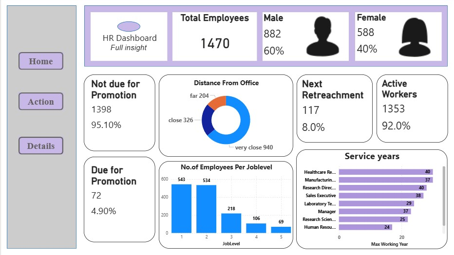
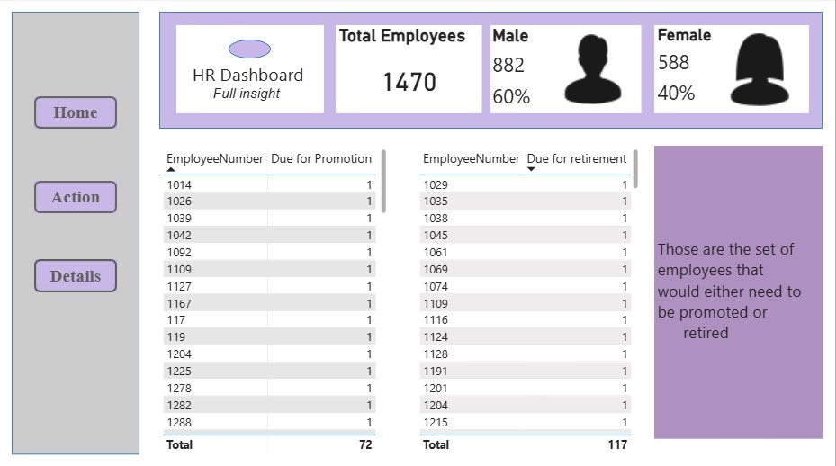
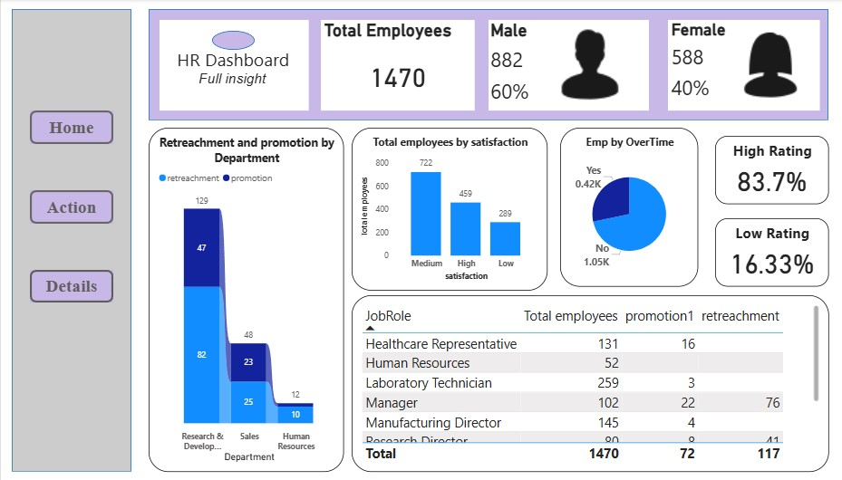

# HR Analytics Dashboard

## Project Overview

The HR Analytics Dashboard is an interactive Business Intelligence solution developed using Power BI to analyze workforce data and support Human Resource decision-making. The dashboard provides insights into employee demographics, promotion eligibility, retirement planning, workforce performance, employee satisfaction, overtime trends, and organizational structure.

The project transforms raw HR data into meaningful visualizations and key performance indicators (KPIs), enabling HR teams to monitor workforce trends and make data-driven decisions.

---

## Objectives

* Analyze workforce demographics and employee distribution.
* Track employees eligible for promotion.
* Identify employees approaching retirement.
* Monitor employee satisfaction levels.
* Evaluate workforce performance through rating analysis.
* Analyze overtime trends and workload distribution.
* Support strategic workforce planning and succession management.

---

## Tools & Technologies Used

* Power BI
* Power Query
* DAX (Data Analysis Expressions)
* Microsoft Excel

---

## Dashboard Pages

### Home Dashboard

The Home Dashboard provides a high-level overview of the workforce and key HR metrics.

#### Key Metrics

* Total Employees: 1470
* Male Employees: 882 (60%)
* Female Employees: 588 (40%)
* Due for Promotion: 72 Employees (4.9%)
* Not Due for Promotion: 1398 Employees (95.1%)
* Active Workers: 1353 Employees (92%)
* Next Retrenchment: 117 Employees (8%)

#### Analysis Included

* Workforce Demographics
* Promotion Status
* Active Workforce Analysis
* Distance from Office Analysis
* Employee Distribution by Job Level
* Service Years Analysis

---

### Action Dashboard

The Action Dashboard focuses on employees requiring immediate HR attention.

#### Analysis Included

* Employees Due for Promotion
* Employees Due for Retirement
* Workforce Action Planning
* Succession Planning Support

This dashboard enables HR teams to quickly identify employees requiring promotion reviews and retirement planning.

---

### Details Dashboard

The Details Dashboard provides in-depth workforce analytics and performance insights.

#### Department-wise Promotion & Retrenchment Analysis

* Research & Development: Promotion (47), Retrenchment (82)
* Sales: Promotion (23), Retrenchment (25)
* Human Resources: Promotion (2), Retrenchment (10)

#### Employee Satisfaction Analysis

* Medium Satisfaction: 722 Employees
* High Satisfaction: 459 Employees
* Low Satisfaction: 289 Employees

#### Employee Rating Analysis

* High Rating Employees: 83.7%
* Low Rating Employees: 16.33%

#### Additional Analysis

* Employee Overtime Analysis
* Job Role Analysis
* Department-wise Workforce Planning

---

## Key Insights

* The organization maintains a workforce of 1470 employees.
* Only a small percentage of employees are currently eligible for promotion.
* Most employees remain active within the organization.
* Research & Development requires the highest workforce planning attention.
* Employee satisfaction is primarily concentrated in the Medium and High satisfaction categories.
* The majority of employees demonstrate strong performance ratings.
* Workforce planning can be enhanced through promotion and retirement tracking.

---

## Business Impact

This dashboard helps HR professionals:

* Monitor workforce demographics and trends.
* Improve promotion and retirement planning.
* Support succession management initiatives.
* Analyze employee engagement and satisfaction.
* Evaluate workforce performance.
* Reduce manual reporting efforts.
* Enable data-driven HR decision-making.

---

## Project Files

* **HR_Analytics_Data** – Raw HR dataset
* **HR Analytics Dashboard.pbix** – Power BI dashboard file.
* **HR_Analytics_Report.pdf** – Project documentation and analysis report.
* **Screenshots Folder** – Dashboard screenshots for quick preview.

---

## Conclusion

The HR Analytics Dashboard successfully transforms employee data into actionable business insights through interactive visualizations and KPI-driven reporting. By integrating workforce demographics, promotion planning, retirement analysis, employee satisfaction, and performance monitoring into a single solution, the dashboard enables effective workforce management and strategic HR decision-making.

---

## Author

**Jyothi D V**

Aspiring Data Analyst | Power BI | SQL | Python | MS Excel

